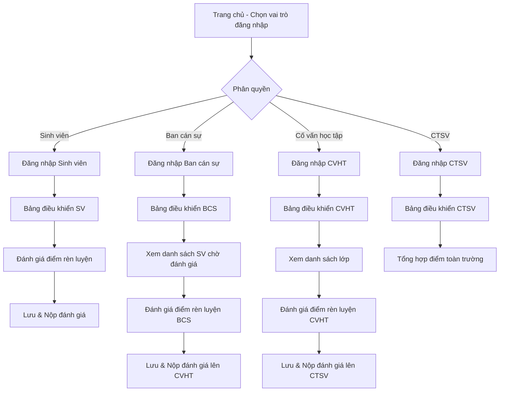

# HỆ THỐNG QUẢN LÝ ĐIỂM RÈN LUYỆN SINH VIÊN

## Tổng quan

Hệ thống Quản lý Điểm Rèn Luyện Sinh viên là ứng dụng web giúp tự động hóa quy trình đánh giá, phê duyệt và quản lý điểm rèn luyện cho sinh viên. Hệ thống hỗ trợ 4 vai trò người dùng chính:
- Sinh viên
- Ban cán sự lớp
- Cố vấn học tập
- Phòng Công tác Sinh viên

## Cài đặt và Chạy

### Yêu cầu
- Trình duyệt web hiện đại (Chrome, Firefox, Edge, Safari)

### Cách cài đặt
1. Tải toàn bộ dự án về máy
2. Mở file `index.html` bằng trình duyệt, hoặc triển khai lên máy chủ web


## Luồng xử lý chính



### Quy trình đánh giá điểm rèn luyện

1. **Sinh viên** tự đánh giá điểm rèn luyện và nộp phiếu đánh giá
2. **Ban cán sự lớp** xem, đánh giá lại và nộp lên cho cố vấn học tập
3. **Cố vấn học tập** xem, phê duyệt và nộp lên phòng công tác sinh viên
4. **Phòng Công tác Sinh viên** tổng hợp và xử lý kết quả cuối cùng

## Hướng dẫn sử dụng

### 1. Đăng nhập

Từ trang chủ, người dùng chọn vai trò phù hợp và đăng nhập vào hệ thống:
- Sinh viên: Sử dụng MSSV và mật khẩu
- Ban cán sự lớp: Sử dụng mã BCS và MSSV, mật khẩu
- Cố vấn học tập: Sử dụng mã CVHT và mật khẩu
- Phòng CTSV: Sử dụng mã phòng và mật khẩu

### 2. Dành cho Sinh viên

#### a. Bảng điều khiển sinh viên
- Xem thông tin cá nhân
- Xem thông báo từ Ban cán sự, CVHT
- Truy cập nhanh đến chức năng Đánh giá điểm rèn luyện

#### b. Đánh giá điểm rèn luyện
- Nhập điểm tự đánh giá cho từng mục
- Lưu phiếu đánh giá
- Nộp phiếu đánh giá cho Ban cán sự lớp

### 3. Dành cho Ban cán sự lớp

#### a. Bảng điều khiển BCS
- Xem danh sách sinh viên trong lớp
- Xem trạng thái đánh giá điểm rèn luyện của từng sinh viên
- Chọn sinh viên để đánh giá

#### b. Phiếu đánh giá điểm rèn luyện (BCS)
- Xem điểm sinh viên tự đánh giá
- Nhập điểm đánh giá của BCS
- Thêm phản hồi nếu cần thiết
- Lưu và nộp đánh giá lên CVHT

### 4. Dành cho Cố vấn học tập

#### a. Bảng điều khiển CVHT
- Xem danh sách lớp phụ trách
- Xem trạng thái đánh giá điểm rèn luyện của từng lớp/sinh viên
- Chọn lớp/sinh viên để xem chi tiết và đánh giá

#### b. Phiếu đánh giá điểm rèn luyện (CVHT)
- Xem điểm SV tự đánh giá và điểm BCS đánh giá
- Phê duyệt hoặc điều chỉnh điểm
- Thêm phản hồi nếu cần thiết
- Nộp phiếu đánh giá lên phòng CTSV

### 5. Dành cho Phòng Công tác Sinh viên

#### a. Bảng điều khiển CTSV
- Xem tổng quan trạng thái đánh giá điểm rèn luyện toàn trường
- Quản lý thông báo và thời hạn đánh giá

#### b. Quản lý kết quả
- Tổng hợp và xử lý kết quả đánh giá
- Xuất báo cáo và thống kê

## Cấu trúc dự án

```
/
├── index.html          # Trang chủ ứng dụng
├── js/
│   └── app.js          # JavaScript chính của ứng dụng
└── layout/             # Các trang layout của ứng dụng
    ├── BangDieuKhienBCS.html            # Bảng điều khiển BCS
    ├── BangDieuKhienCTSV.html           # Bảng điều khiển CTSV
    ├── BangDieuKhienCVHT.html           # Bảng điều khiển CVHT
    ├── BangDIeuKhienSinhVien.html       # Bảng điều khiển SV
    ├── DangNhapBanCanSu.html            # Trang đăng nhập BCS
    ├── DangNhapCongTacSinhVien.html     # Trang đăng nhập CTSV
    ├── DangNhapCoVanHocTap.html         # Trang đăng nhập CVHT
    ├── DangNhapSinhVien.html            # Trang đăng nhập SV
    ├── DanhSachLop.html                 # Danh sách lớp
    ├── DieuHuongDangNhap.html           # Trang điều hướng đăng nhập
    ├── LayLaiMatKhau.html              # Trang lấy lại mật khẩu
    ├── PhieuDiemRenLuyenBCS.html        # Phiếu đánh giá của BCS
    ├── PhieuDiemRenLuyenCVHT.html       # Phiếu đánh giá của CVHT
    └── PhieuDRLSinhVien.html            # Phiếu đánh giá của SV
```
